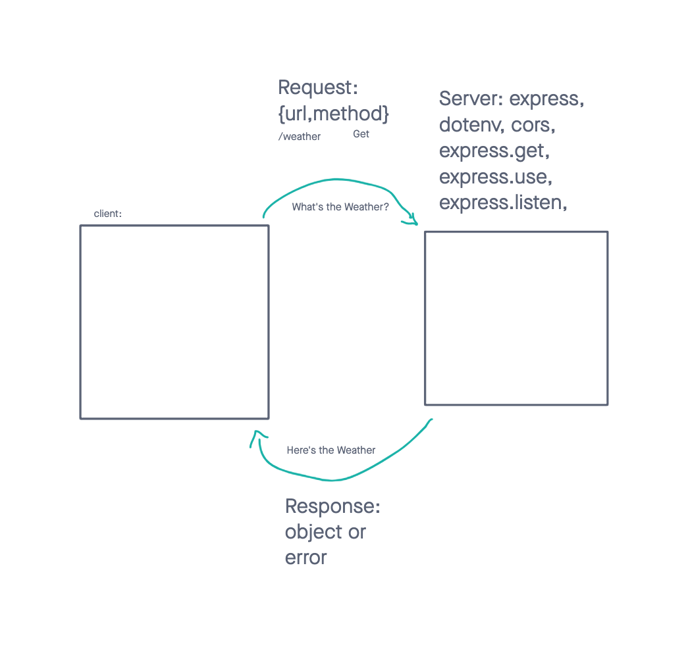
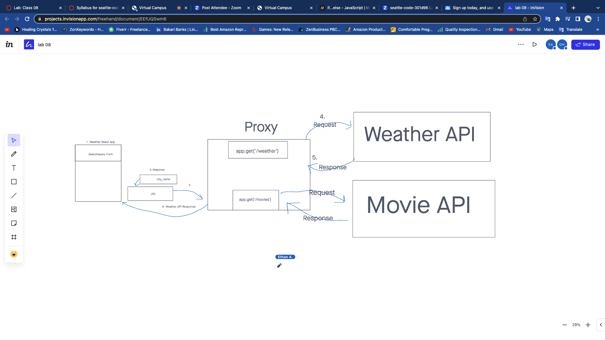

**Author**: Darran Holes
**Version**: 1.0.0 (increment the patch/fix version number if you make more commits past your first submission)

## Overview
<!-- Provide a high level overview of what this application is and why you are building it, beyond the fact that it's an assignment for this class. (i.e. What's your problem domain?) -->
This application will enable a user to enter a city name and the latitude, longitude, and a map will display on the page.

## Getting Started
<!-- What are the steps that a user must take in order to build this app on their own machine and get it running? -->
They would need to copy the could but get there own access key.

## Architecture
<!-- Provide a detailed description of the application design. What technologies (languages, libraries, etc) you're using, and any other relevant design information. -->
In order to build the website I will need JS, CSS, HTML, React, React-Router-DOM, Bootstrap, and Axious

## Change Log
<!-- Use this area to document the iterative changes made to your application as each feature is successfully implemented. Use time stamps. Here's an example:

01-01-2001 4:59pm - Application now has a fully-functional express server, with a GET route for the location resource. -->

## Credit and Collaborations
<!-- Give credit (and a link) to other people or resources that helped you build this application. -->

Lab 7 

Name of feature: City Explore

Estimate of time needed to complete: 3 hours

Start time: 5:25pm

Finish time: 7:30pm different day

Actual time needed to complete: 9-10 hours

Lab 8 
Name of feature: Class 8
Estimate of time needed to complete: 5hrs

Start time: 

Finish time: 

Actual time needed to complete: 7 hours

Lab 7 WRRC

Lab 8 WRRC

Lab 9 WRRC
